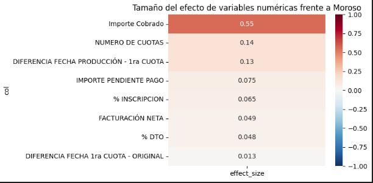
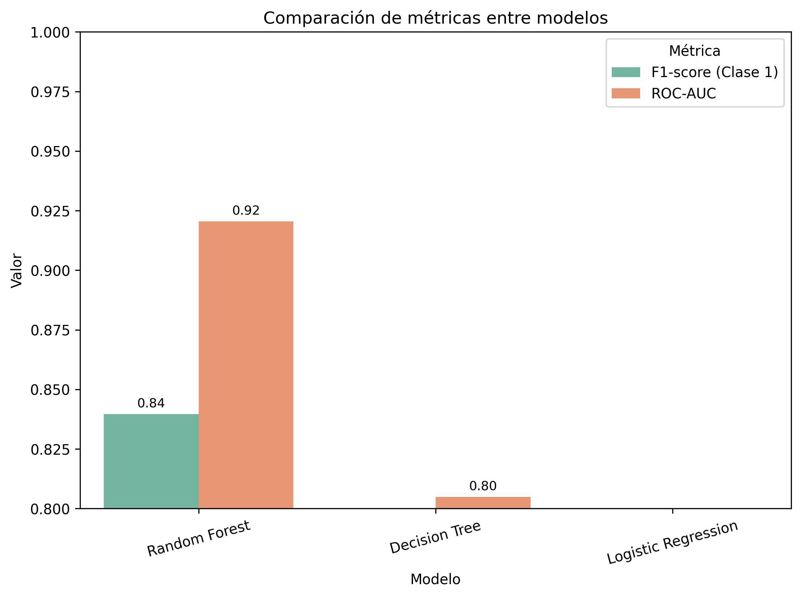

# Prediccion de Morosidad en Educacion Superior

Este repositorio contiene el flujo completo para construir y desplegar un modelo de clasificacion que estima la probabilidad de impago de nuevos alumnos en una escuela de negocios. Incluye el preprocesamiento de datos historicos, el entrenamiento del modelo y una aplicacion Streamlit para consultar predicciones de forma interactiva.
## App en Streamlit Cloud
Puedes acceder directamente a la app a través del siguiente enlace:

[Accede a la app](https://prediccion-morosidad.streamlit.app/)
## Caracteristicas principales
- Limpieza, normalizacion y enriquecimiento de los datos historicos (`scr/data.py`).
- Utilidades de analisis estadistico y generacion de features (`scr/utils.py`, `scr/feature.py`).
- Modelo Random Forest optimizado serializado en `models/modelo_random_forest_optimizado.pkl` y pipeline completo en `models/pipeline_final.pkl`.
- Aplicacion web (`streamlit_app/app.py`) que calcula automaticamente los campos dependientes y muestra la probabilidad de impago.
- Notebooks exploratorios y de entrenamiento en la carpeta `notebooks/` para reproducir el proceso completo.

## Estructura del proyecto
- `data/`
  - `raw/`: fuentes originales (Excel)
  - `processed/`: datos procesados listos para modelar
  - `test/`: conjuntos de prueba exportados desde los notebooks
- `models/`: artefactos entrenados (`.pkl`)
- `notebooks/`: analisis exploratorio y entrenamiento
  - `01_eda.ipynb`: Análisis esxploratorio y estadístico de los datos.
  - `02_model_training.ipynb`: Feature engineering, entrenamiento y guardado de los modelos. 
  - `03_evaluation.ipynb`: Evaluación de los distintos modelos
- `scr/`
  - `data.py`: pipeline de tratamiento de datos
  - `feature.py`: conversores y helpers
  - `utils.py`: utilidades de estadistica y evaluacion
- `streamlit_app/`
  - `app.py`: aplicacion Streamlit de consulta del modelo
- `example_csv/` archivo de ejemplo para cargar en la app de streamlit
- `requirements.txt`: dependencias del proyecto
- `README.md`

## Requisitos
- Python 3.10+ (el proyecto se ha probado con Python 3.11).
- Dependencias listadas en `requirements.txt`:
  - joblib, numpy, openpyxl, pandas, scikit-learn, scipy, streamlit.

Instalacion:
```
python -m venv .venv
. .venv\Scripts\activate     # En Windows PowerShell
pip install --upgrade pip
pip install -r requirements.txt
```

## Uso de la aplicacion Streamlit
1. Activa tu entorno virtual y asegurate de haber instalado las dependencias.
2. Ejecuta el servidor local:
   ```
   streamlit run streamlit_app/app.py
   ```
3. Abre el enlace que Streamlit muestra en consola (por defecto http://localhost:8501).

La interfaz solicita los datos relevantes del alumno; el script calcula automaticamente:
- Importe de inscripcion (facturacion neta x porcentaje de inscripcion).
- Importe pendiente (facturacion neta - importe cobrado, nunca negativo).
- Consistencia de los medios de pago, que alimenta features binarias.


## Reentrenamiento del modelo
- El preprocesamiento de datos se encuentra en `scr/data.py`. Ejecutalo cuando existan nuevas fuentes en `data/raw/` para actualizar `data/processed/data.csv`.
- Los notebooks de la carpeta `notebooks/` documentan el entrenamiento, la seleccion de hiperparametros y la evaluacion. Ejecutalos en orden para regenerar el modelo si se actualizan los datos.
- Guarda los artefactos nuevos en `models/` y actualiza la app si cambia el nombre o formato del modelo.

# Resultados visuales del análisis y del modelo

## Distribución de impago según % de inscripción


Se observa que los grupos con menor % de inscripción concentran mayores tasas de impago (13.9 % en el grupo 0–13 %), mientras que al aumentar la inscripción inicial, la morosidad desciende (7.2 % en el grupo 16–20 % y 6.1 % en el resto). Esto confirma la importancia de los pagos tempranos.

---

## Asociación de variables categóricas con morosidad


Las variables categóricas más asociadas a la morosidad son **País de residencia** (Cramér’s V = 0.21), **Forma de pago** (0.20) y **Nacionalidad** (0.19). Aunque las asociaciones no son extremadamente fuertes, sí reflejan patrones relevantes en los métodos y origen de los alumnos.

---

## Tamaño del efecto en variables numéricas


Entre las variables numéricas, la más influyente es el **Importe Cobrado** (efecto = 0.55, negativo respecto a la morosidad). Otras variables como **Número de cuotas** y la **Diferencia entre fecha de producción y 1ª cuota** tienen un impacto mucho menor.

---

## Árbol de decisión


El árbol de decisión muestra que las primeras divisiones relevantes para predecir morosidad están relacionadas con el **mantenimiento del medio de pago**, el **país de residencia** y el **importe cobrado**. Esto está alineado con los hallazgos del análisis exploratorio.

---

## Curvas Precision-Recall


El **Random Forest** domina en todos los rangos de recall, mostrando un mejor equilibrio entre precisión y exhaustividad. El **árbol de decisión** queda en un nivel intermedio y la **regresión logística** se rezaga, especialmente en recalls altos.

---

## Curvas ROC


El **Random Forest** alcanza un AUC de 0.92, muy superior al del **árbol de decisión** (0.80) y la **regresión logística** (0.77). Esto confirma su mayor capacidad discriminativa.

---

## Comparación de métricas entre modelos


El **Random Forest** logra el mejor desempeño tanto en **F1-score (0.84)** como en **ROC-AUC (0.92)**, confirmándose como la mejor alternativa frente a modelos más simples.

---
